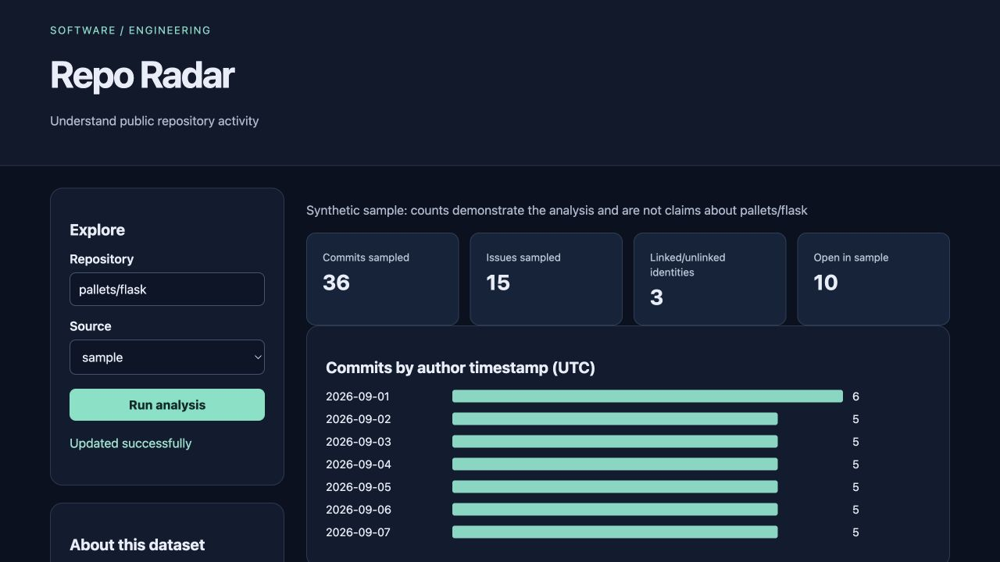

# Repo Radar

Understand public repository activity for **job seekers and maintainers**.

Original topic: **GitHub Activity Visualizer** from [the source post](https://www.instagram.com/p/DdyMaogE4ud/).

> Local portfolio implementation developed with Codex assistance. Measured results and limitations are documented; no production adoption, revenue or hiring outcome is claimed.



## What works

- GitHub pagination
- cached snapshots
- contributor/issue trends
- offline sample

[Example output](reports/example-output.json) · [Recorded checks](reports/test-results.txt) · [Learning and interview guide](LEARNING_GUIDE.md)

## Start

Python 3.12 is the validated Python runtime. Run commands from this repository directory. Windows users activate `.venv\Scripts\activate` instead of `source`.

```sh
python3.12 -m venv .venv
source .venv/bin/activate
python -m pip install -r requirements.txt
python app.py
```

Open **http://127.0.0.1:8080**. Keep the process running. Set `PORT` to use another port (Retention Studio uses `--port`). The Python development servers are intended for local demonstrations.

## Demonstration

Run sample mode and reconcile 36 commits across contributors and dates. Switch to a public owner/repository in live mode; inspect the retrieval timestamp and bounded-coverage note.

## Architecture and decisions

Browser controls → validated Flask API → project analysis/workflow → results and export.

Stack: Python · Flask.

1. Cap API pagination at three pages to bound response time and unauthenticated rate use.
2. Cache public snapshots for five minutes, clearly separating sample and live modes.
3. Exclude pull-request records from issue totals and avoid treating commit counts as productivity.

## Verification

```sh
python -m pytest -q
```

See [VERIFICATION.md](VERIFICATION.md) for actual executed checks, setup verification, model/data results and any outstanding environment limitations. A workflow file alone is not evidence that CI passed.

## Data and attribution

GitHub REST API; labeled fixture. See [DATA_AND_SOURCES.md](DATA_AND_SOURCES.md) for provenance and usage notes. Original project code is MIT unless a preserved source file or dependency states otherwise. Model and third-party data licenses remain separate.

## Limitations and next improvement

At most 300 commits and 300 default issue-endpoint records. GitHub's issues endpoint defaults to open issues, so live issue counts describe the returned open sample. Commit timestamps are author times. No private repository tokens are used.

Suggested extension: Add an explicit issues state selector and preserve the state in the cache key.

## Honest portfolio use

This implementation and documentation were developed with substantial Codex assistance. Before presenting it, run the demonstration, explain the design choices, and complete the suggested independent modification. Do not describe generated code as work experience, an accepted upstream contribution, or a deployed production service.
